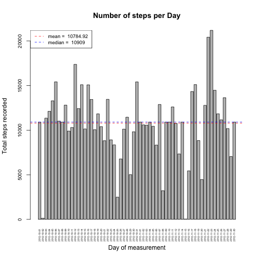

# Reproducible Research: Peer Assessment 1

This Assessment consists in a short Analysis of a "quantified self dataset".

The data consists of two months of data from an anonymous individual collected during the months of October and November, 2012 and include the number of steps taken in 5 minute intervals each day.

## Loading and preprocessing the data
The loading and preprocessing phase of the data was performed using the following R code.

```r
unzip('activity.zip')
activityData <- read.csv('activity.csv')
activityData$date <- as.Date(activityData$date)
```

This is how the imported data looks like:

```r
str(activityData)
```

```
## 'data.frame':	17568 obs. of  3 variables:
##  $ steps   : int  NA NA NA NA NA NA NA NA NA NA ...
##  $ date    : Date, format: "2012-10-01" "2012-10-01" ...
##  $ interval: int  0 5 10 15 20 25 30 35 40 45 ...
```

## Common utilty functions
Two utilities functions were created in order to simplify the generation of the figures for the analysis that was performed.

The following function was created to **plot an histogram of total steps per day**:


```r
plotTotalStepsPerDay <- function(data, title="Number of steps per Day") {
    stepsPerDay <- aggregate(data$steps, by=list(date=data$date), FUN=sum,  na.rm=TRUE)
    colnames(stepsPerDay) <- c('date','totalSteps')
    meanStepsPerDay <- mean(stepsPerDay$totalSteps)
    medianStepsPerDay <- median(stepsPerDay$totalSteps)
    
    with(stepsPerDay, barplot(totalSteps, names.arg = date,
                              xlab="Day of measurement",
                              ylab="Total steps recorded",
                              main=title,
                              las=3,
                              cex.names =.4, cex.axis=.8))
    abline(h=meanStepsPerDay, col="red", lty=2)
    abline(h=medianStepsPerDay, col="blue", lty=2)
    legend("topleft", col=c("red","blue"), lty=2,
           legend=c(paste("mean = ",round(meanStepsPerDay, digits=2)),
                    paste("median = ", medianStepsPerDay)),
           bg="transparent",
           cex=.8)
    return(data.frame(mean=meanStepsPerDay, median=medianStepsPerDay))
}
```

The following function was created to **plot a time series of average steps per 5-minute interval**:

```r
plotAvgIntervalStepsTimeSeries <- function(data, title="Average steps per 5-minute interval"){
    avgIntervalSteps <- aggregate(data$steps, by=list(interval=data$interval), FUN=mean,  na.rm=TRUE)
    colnames(avgIntervalSteps) <- c('interval','averageSteps')
    maxAvgSteps <- max(avgIntervalSteps$averageSteps)
    argmaxAvgSteps <- avgIntervalSteps[which.max(avgIntervalSteps$averageSteps),]$interval
    
    with(avgIntervalSteps, plot(interval, averageSteps,
                                xlab="5-minute interval of measurement",
                                ylab="Average number of steps",
                                main=title,
                                las=3,
                                type="l"))
    abline(v=argmaxAvgSteps, col="blue", lty=2)
    points(argmaxAvgSteps, maxAvgSteps, col="red", pch=8, lwd=2)
    legend("topright", col="red", pch=8, lwd=2, lty=NA,
           legend=paste("max = ", round(maxAvgSteps, digits=2)),
           cex=.9)
    return(data.frame(argmax=argmaxAvgSteps, max=maxAvgSteps))
}
```

Both of these functions will be used in the following paragraphs to perform the Data Analysis.

## What is mean total number of steps taken per day?
An histogram of total number of steps was produced. Note that any NA value would be removed by the utility function.


```r
totStepStat <- plotTotalStepsPerDay(activityData)
```

 

The average number of steps per day is 9354.2295, and the median number of steps per day is 10395.

## What is the average daily activity pattern?
By averaging over the 5-minute intervals, a time series of daily ativity pattern was produced.


```r
avgStepStat <- plotAvgIntervalStepsTimeSeries(activityData)
```

 

The maximum 5-minute interval number of steps (averaged over the days in the dataset) is 206.1698 and is reached at the 835° 5-minute interval of the day.

## Imputing missing values
The above analysis was done by excluding the NA values from the dataset. The number of NA that are present for each column is:

```r
colSums(is.na(activityData))
```

```
##    steps     date interval 
##     2304        0        0
```

In order to clean the NAs, we decided to associate to each NA in the steps column of the data frame the average number of steps associated to its 5-minute interval (computed on the entire dataset).

The following transformation was applied:

```r
avgStepsPerInterval <- aggregate(activityData$steps,
                                 by=list(interval=activityData$interval),
                                 FUN=mean,  na.rm=TRUE)
colnames(avgStepsPerInterval) <- c('interval','averageSteps')

cleanActivityData <- merge(x=activityData,
                           y=avgStepsPerInterval,
                           by="interval")

cleanActivityData$steps <- mapply(function(x,y) ifelse(is.na(x),
                                                       round(y), x),
                                  cleanActivityData$steps,
                                  cleanActivityData$averageSteps)
# remove added column and unused datasets
cleanActivityData <- cleanActivityData[,-c(4)]
remove(avgStepsPerInterval)
```

The cleaned activity dataset can be now used to perform the same analysis performed on the original data set. In particular, the histogram of total steps taken per day becomes ad follows:

```r
totStepStatC <- plotTotalStepsPerDay(cleanActivityData)
```

 

Now, the average number of steps per day is 1.0766 &times; 10<sup>4</sup>, and the median number of steps per day is 1.0762 &times; 10<sup>4</sup>.


## Are there differences in activity patterns between weekdays and weekends?
In order to compare the different pattern of steps in weekdays and weekends, the (cleaned) activity data frame was split into two distinct data frames, according to the day type (weekend or weekday):

```r
# NOTE: the following step probably requires English Locale
cleanActivityData$dayType <- as.factor(ifelse(weekdays(cleanActivityData$date) %in% c("Saturday", "Sunday"),"weekend","weekday"))

cleanWEActivityData <- subset(cleanActivityData,
                              dayType=="weekend",
                              select=c("interval","steps","date"))
cleanWDActivityData <- subset(cleanActivityData,
                              dayType=="weekday",
                              select=c("interval","steps","date"))
```

With these two datasets, a comparative time serie was produced. One time series considers only weekdays and the other considers only weekends:

```r
par(mfrow=c(2,1))
par(mar=c(4,4,2,2))
avgWDStepStatC <- plotAvgIntervalStepsTimeSeries(cleanWDActivityData,
                    title="Average steps per 5-minute interval (weekday)")
avgWEStepStatC <- plotAvgIntervalStepsTimeSeries(cleanWEActivityData,
                    title="Average steps per 5-minute interval (weekend)")
```

 

In weekdays, the maximum value of the average 5-minute interval number of steps is 230.3556 and is reached at the 835° 5-minute interval of the day.

In weekends, the maximum value of the average 5-minute interval number of steps is 166.625 and is reached at the 915° 5-minute interval of the day.

Note that the cleaning operation has not changed the same statistics computed over all days.
